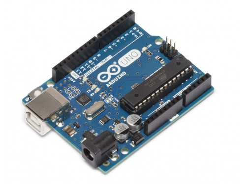
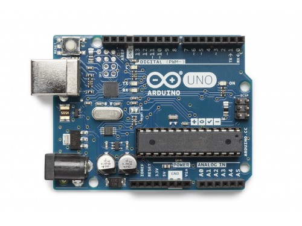

## Plan spotkania

1. Krótko o Arduino UNO
1. Struktura programu
1. Arduino IDE
1. Oscyloskop
1. Stan wysoki i niski
1. RGB LED
1. Przycisk
1. Zadanie 1.: prosty program kombinacyjny
1. PWM
1. Animacje RGB
1. Zadanie 2.: kolorowe sekwencje
---

## Krótko o Arduino UNO



+++



---

## Struktura programu

+++?code=code/hello.cpp

###### Hello world: **C++**

+++?code=code/blink.ino

@[1,3]
@[5,10]
@[2]
@[6]
@[7]
@[8]
@[9]

###### Hello world: **Arduino**

(mruganie LED)

+++

```
int main(void) {
  init();
  initVariant();
  #if defined(USBCON)
    USBDevice.attach();
  #endif
  setup();
  for (;;) {
    loop();
    if (serialEventRun) serialEventRun();
  }
  return 0;
}
```

@[1,7-9,11-13]

Napisana za nas funkcja *main()*

---

## Adruino IDE

Jak skompilować i uruchomić program?

---

## Oscyloskop

---

## Stan wysoki i niski (Arduino UNO)

* wyjścia
  * $$HIGH: \approx 5\;V$$
  * $$LOW: \approx 0\;V$$

* wejścia
  * $$ > 3\;V \implies HIGH$$
  * $$ < 1,5\;V \implies LOW$$

---

## Zadanie 1.

Napiszcie program, który będzie działał w następujący sposób:

* *P* **wciśnięty** i *F* **niezasłonięty** => *D*: **zielona**

* *P* **wciśnięty** i *F* **zasłonięty** => *D*: **czerwona**

* w pozostałych przypadkach *D* nie świeci

+++?code=code/task1.ino

#### Przykład rozwiązania

---

