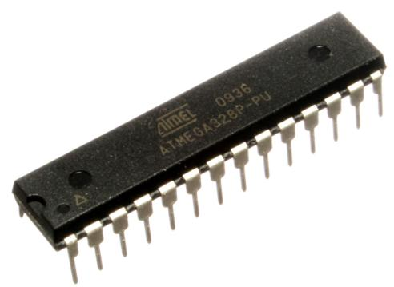

---

Wstęp do IoT na przykładzie Arduino UNO


Note:
- 2 urządzenia: UNO i oscyloskop

---

### Krystian Chachuła

- [krystiancha@gmail.com](mailto:krystiancha@gmail.com)
- [github.com/protecto](https://github.com/protecto)

---

### Plan

1. Arduino UNO
1. Oscyloskop
1. Hello World
1. Wyjścia cyfrowe
1. Wejścia cyfrowe
1. Wyjścia PWM
1. Wejścia analogowe
1. Animacje RGB

---

### Arduino UNO

**Uno**: (*język włoski*) jeden


Note:
- z okazji udostępnienia środowiska Arduino IDE 1.0

+++

#### mikrokontroler **ATmega328P**



+++

#### mikrokontroler **ATmega328P**

- 14 cyfrowych wejść/wyjść
    - w tym 6 PWM           |
- 6 analogowych wejść       |
- do 20 Mhz                 |
    - w Arduino UNO: 16 Mhz |

Note:
- porównaj do CPU w PC (zegar)

---

### Oscyloskop

Pokazuje wykres napięcia od czasu


Note:
- dmm vs dso
- po co?
    - bardzo szybkie sygnały
    - zrozumienie/"czucie" obwodu
    - naprawianie urządzeń
- pokaż sygnał audio
- pokaż zegar

---?code=assets/code/hello.cpp

### Hello World (C++)

Note:
- coś innego za pomocą tego, co już umiecie

+++?code=assets/code/sketches/blink/blink.ino

@[1,3]
@[5,10]
@[2]
@[6]
@[7]
@[8]
@[9]

### Hello World (Arduino)

Note:
- HIGH/LOW
- digitalWrite()
- delay()

+++

```
int main(void) {
  init();
  initVariant();
  ###if defined(USBCON)
    USBDevice.attach();
  ###endif
  setup();
  for (;;) {
    loop();
    if (serialEventRun) serialEventRun();
  }
  return 0;
}
```

@[1,7-9,11-13]

### Ukryta funkcja `main()`

Note:
- co to for(;;)?

+++

### Arduino IDE


Note:
- odpal IDE
- wczytaj skecz (programy to skecze)
- wybierz port
- skompiluj i uruchom

---

### Wyjścia cyfrowe

#### LEDy na płytce

- R: czerwona, dyskretna (pin 7)
- Y: żółta, dyskretna (pin 12)      |
- RGB: 3 diody w jednej             |
    - RGBr: czerwona (pin 9)        |
    - RGBg: zielona (pin 10)        |
    - RGBb: niebieska (pin 11)      |

+++

#### sterowanie LEDami

- włącz: `digitalWrite(pin, HIGH);`
- wyłącz: `digitalWrite(pin, LOW);`

---

### Wejścia cyfrowe

#### Na płytce:

- B: przycisk "chwilowy" (pin 8)
- S: przełącznik (pin 2)            |
- C: wykrywacz klaśnięć (pin 3)     |

+++

#### Sprawdzanie stanu

`int stan = digitalRead(pin);`

Zmienna stan przyjmie wartość:
- `HIGH`, gdy czujnik jest nieaktywny
    - np. przycisk nie jest wciśnięty
- `LOW`, gdy czujnik jest aktywny
    - np. przycisk jest wciśnięty

Note:
- odwrotnie niż intuicyjnie

---

### Zadanie 1.

Napiszcie program, który będzie naśladował światła pojazdu uprzywilejowanego na początku lub końcu kolumny.
Światła te włączamy przełącznikiem **S**, a po ich włączeniu dioda **RGB** świeci na zmianę na czerwono lub niebiesko. Zmiana koloru na przeciwny następuje po ok. 0.25 s.
Jeśli dodatkowo przytrzymamy przycisk **B**, szybkość zmian kolorów zwiększa się dwukrotnie.

Note:
- zanim uruchomić, skompilować, przetestować w głowie
- jakich pinów będziemy używać? B(8) S(2) RGBr(9) RGBb(11)
- jak będzie wyglądał warunek? digitalRead(2)
- co ma dziać się gdy jest wyłączony? LOW na oba kolory
- jak wygląda mruganie diodami na zmianę? 9H 11L delay 9L 11H
- jak modyfikować czas delaya? d = war ? 250 : 125

+++?code=assets/code/sketches/task1/task1.ino

@[8-21]

---

### Zadanie 2.

Poprawcie kod z zadania 1. tak, aby odwrócić role przycisku i przełącznika.
Przycisk **B** będzie służył do włączania i wyłączania świateł. (pierwsze wciśnięcie: włącz, drugie wciśnięcie: wyłącz)
Przełącznik **S** będzie natomiast służył do przyspieszania zmian koloru.

Note:
- co trzeba dodać? pamięć do wykrywania zbocza
    - dwie zmienne-

+++?code=assets/code/sketches/task2/task2.ino

@[1-2]
@[12-16]
@[16-29]

---

### Wyjścia PWM

**PWM**: pulse width modulation, modulacja szerokości impulsu

Note:
PWM przy ściemnianiu wyświetlacza
pokaż PWM na oscyloskopie (sketch pwmdemo)

+++

#### Płynna regulacja jasności świecenia RGB LED

`analogWrite(pin, liczba)`

`liczba` może przyjmować wartości:
- od 0 (dioda nie świeci, jak `LOW`)
- poprzez 127 (dioda świeci połową mocy)
- do 255 (dioda świeci całą mocą, jak `HIGH`)

---

### Wejścia analogowe

`int odczyt = analogRead(pin);`

`odczyt` przyjmie wartość:
- 0, jeśli napięcie jest bliskie 0 V        |
- 511, jeśli napięcie jest bliskie 2,5 V    |
- 1023, jeśli napięcie jest bliskie 5 V     |

---

### Zadanie 3.

Napiszcie program symulujący lampkę z czujnikiem zmierzchowym.
Jeśli jest włączona (przełącznikiem **S**), wszystkie kolory diody **RGB** powinny zaświecić się jednocześnie wtedy i tylko wtedy, gdy zasłonimy fotorezystor **F**.

Note:
Wskazówka:
Można uznać, że fotorezystor jest zasłoniony, gdy napięcie na nim jest równe ok. 2,5 V.

---

### Animacje RGB


<span class="source">Źródło: https://commons.wikimedia.org/wiki/File:RGB_illumination.jpg</span>

Note:
daj pobawić się sketchem 3pot

+++

#### Koło kolorów RGB


<span class="source">Źródło: http://dawnsbrain.com/the-rgb-color-wheel/</source>

+++


<span class="source">Źródło: https://en.wikipedia.org/wiki/HSL_and_HSV#/media/File:HSV-RGB-comparison.svg</span>

+++?image=assets/img/rgb/0.png&size=contain
<!-- .slide: data-background-transition="none" -->
+++?image=assets/img/rgb/1.png&size=contain
<!-- .slide: data-background-transition="none" -->
+++?image=assets/img/rgb/2.png&size=contain
<!-- .slide: data-background-transition="none" -->
+++?image=assets/img/rgb/3.png&size=contain
<!-- .slide: data-background-transition="none" -->
+++?image=assets/img/rgb/4.png&size=contain
<!-- .slide: data-background-transition="none" -->
+++?image=assets/img/rgb/5.png&size=contain
<!-- .slide: data-background-transition="none" -->

---

### Zadanie 4.

Zrealizuj w programie animację określoną funkcjami:


+++

```c++
int f(double x) {
  switch ((int)(x / 255) % 6) {
    case 0:
      return 255;
    case 1:
      return 255 - (int)x % 255;
    // itd.
  }
}
```

---

Tę prezentację można znaleźć pod adresem:

http://gitpitch.com/protecto/warsztaty-arduino

##### Źródła:

- [ATmega328](http://www.microchip.com/wwwproducts/en/ATmega328)
- [Arduino Language Reference](https://www.arduino.cc/reference/en/)
