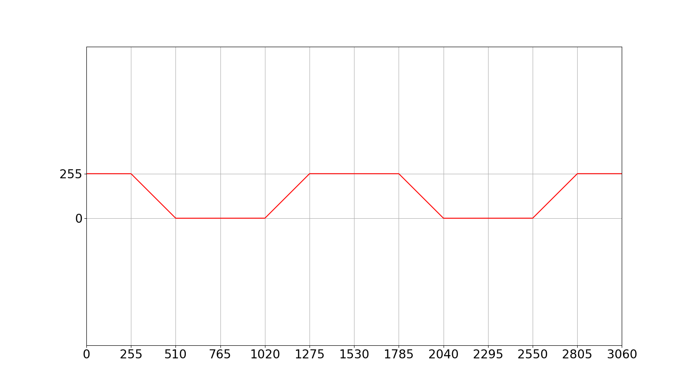
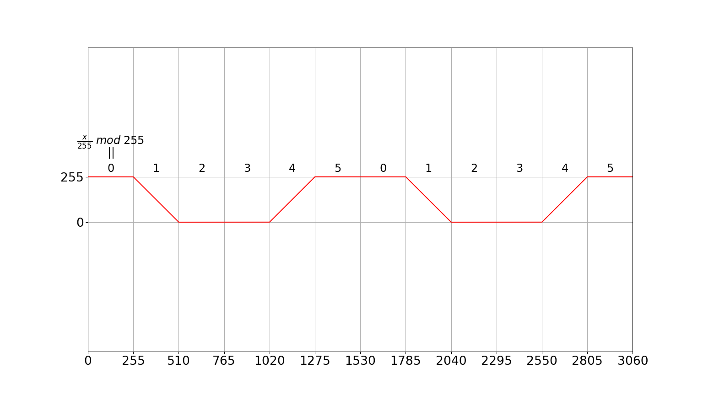
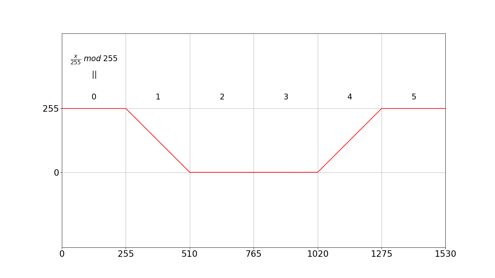
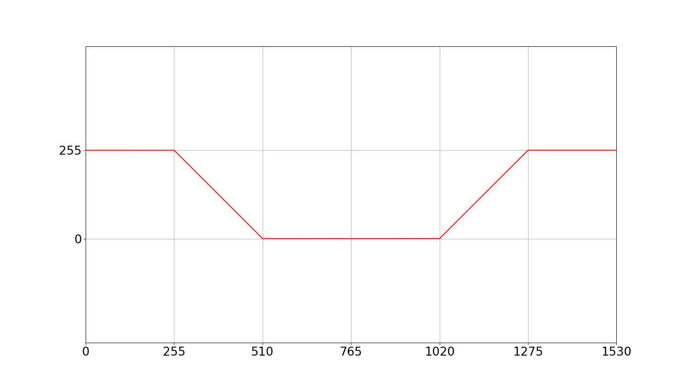
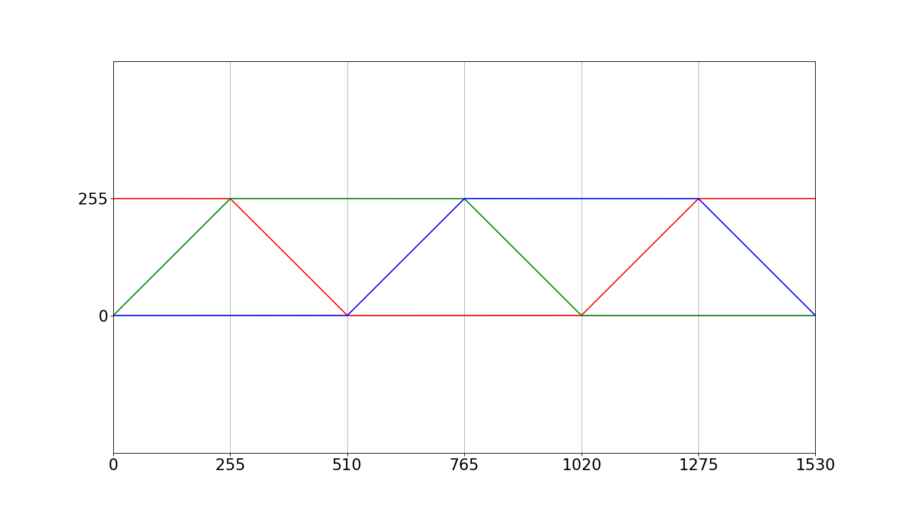
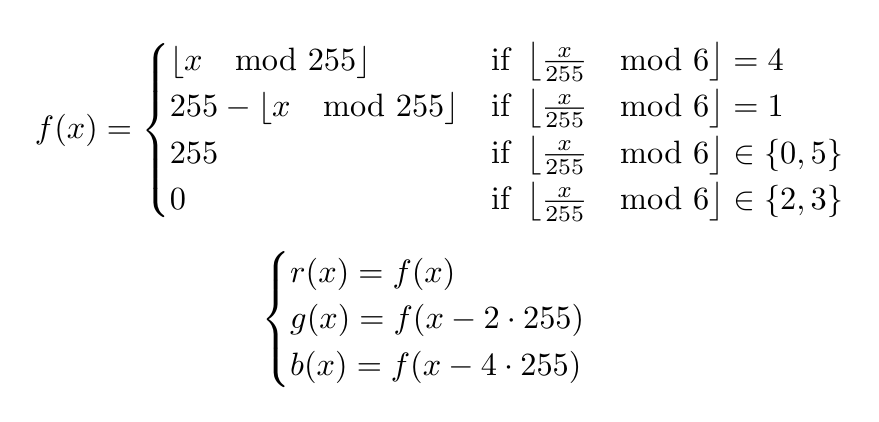

---

Wstęp do IoT na przykładzie Arduino UNO


Note:
2 urządzenia: UNO i oscyloskop

---

### Arduino UNO

**Uno**: (*język włoski*) jeden


+++

- mikrokontroler **ATmega328P**
    - 14 cyfrowych wejść/wyjść  |
        - w tym 6 PWM           |
    - 6 analogowych wejść       |
    - do 20 Mhz                 |
        - w Arduino UNO: 16 Mhz |
        
Note:
- porównaj do CPU w PC
        
---

### Oscyloskop

Pokazuje wykres napięcia od czasu


Note:
po co?
- bardzo szybkie sygnały
- zrozumienie/"czucie" obwodu
- naprawianie urządzeń
pokaż sygnał audio

---?code=assets/code/hello.cpp

### Hello World (C++)

+++?code=assets/code/sketches/blink/blink.ino

@[1,3]
@[5,10]
@[2]
@[6]
@[7]
@[8]
@[9]

Note:
- HIGH/LOW
- digitalWrite()
- delay()

### Hello World (Arduino)

+++

```
int main(void) {
  init();
  initVariant();
  ###if defined(USBCON)
    USBDevice.attach();
  ###endif
  setup();
  for (;;) {
    loop();
    if (serialEventRun) serialEventRun();
  }
  return 0;
}
```

@[1,7-9,11-13]

### Ukryta funkcja `main()`

+++

### Arduino IDE


Note:
- odpal IDE
- wybierz port
- skompiluj i uruchom

---

### Wyjścia cyfrowe

#### LEDy na płytce

- R: czerwona, dyskretna (pin 7)
- Y: żółta, dyskretna (pin 12)      |
- RGB: 3 diody w jednej             |
    - RGBr: czerwona (pin 9)        |
    - RGBg: zielona (pin 10)        |
    - RGBb: niebieska (pin 11)      |

+++

#### sterowanie LEDami

- włącz: `digitalWrite(pin, HIGH);`
- wyłącz: `digitalWrite(pin, LOW);` |

---

### Wejścia cyfrowe

#### Na płytce:

- B: przycisk "chwilowy" (pin 8)
- S: przełącznik (pin 2)            |
- C: wykrywacz klaśnięć (pin 3)     |

+++

#### Sprawdzanie stanu

`int stan = digitalRead(pin);`

Zmienna stan przyjmie wartość:
- `HIGH`, gdy czujnik jest nieaktywny
    - np. przycisk nie jest wciśnięty   |
- `LOW`, gdy czujnik jest aktywny       |
    - np. przycisk jest wciśnięty       |

---

### Zadanie 1.

Napiszcie program, który będzie naśladował światła policyjne.
Światła te włączamy przełącznikiem **S**, a po ich włączeniu dioda **RGB** świeci na zmianę na czerwono lub niebiesko. Zmiana koloru na przeciwny następuje po ok. 0.25 s.
Jeśli dodatkowo przytrzymamy przycisk **B**, szybkość zmian kolorów zwiększa się dwukrotnie.

+++?code=assets/code/sketches/task1/task1.ino

@[8-21]

---

### Zadanie 2.

Poprawcie kod z zadania 1. tak, aby odwrócić role przycisku i przełącznika.
Przycisk **B** będzie służył do włączania i wyłączania świateł. (pierwsze wciśnięcie: włącz, drugie wciśnięcie: wyłącz)
Przełącznik **S** będzie natomiast służył do przyspieszania zmian koloru.

+++?code=assets/code/sketches/task2/task2.ino

@[1-2]
@[12-29]

---

### Wyjścia PWM

**PWM**: pulse width modulation, modulacja szerokości impulsu

Note:
PWM przy ściemnianiu wyświetlacza
pokaż PWM na oscyloskopie (sketch pwmdemo)

+++

#### Płynna regulacja jasności świecenia RGB LED

`analogWrite(pin, liczba)`

`liczba` może przyjmować wartości:
- od 0 (dioda nie świeci, jak `LOW`)            |
- poprzez 127 (dioda świeci połową mocy)        |
- do 255 (dioda świeci całą mocą, jak `HIGH`)   |

---

### Wejścia analogowe

`int odczyt = analogRead(pin);`

`odczyt` przyjmie wartość:
- 0, jeśli napięcie jest bliskie 0 V        |
- 511, jeśli napięcie jest bliskie 2,5 V    |
- 1023, jeśli napięcie jest bliskie 5 V     |

---

### Zadanie 3.

Napiszcie program symulujący lampkę z czujnikiem zmierzchowym.
Jeśli jest włączona (przełącznikiem **S**), wszystkie kolory diody **RGB** powinny zaświecić się jednocześnie wtedy i tylko wtedy, gdy zasłonimy fotorezystor **F**.

Note:
Wskazówka:
Można uznać, że fotorezystor jest zasłoniony, gdy napięcie na nim jest równe ok. 2,5 V. 

---

### Animacje RGB


Note:
daj pobawić się sketchem 3pot 

+++

#### Koło kolorów RGB


+++
<!-- .slide: data-background-transition="none" -->

+++
<!-- .slide: data-background-transition="none" -->

+++
<!-- .slide: data-background-transition="none" -->

+++
<!-- .slide: data-background-transition="none" -->

+++
<!-- .slide: data-background-transition="none" -->

+++
<!-- .slide: data-background-transition="none" -->


---

### Zadanie 4.

Zrealizuj w programie animację określoną funkcjami:



+++

```c++
int f(double x) {
  switch ((int)(x / 255) % 6) {
    case 0:
      return 255;
    case 1:
      return 255 - (int)x % 255;
    // itd.
  }
}
```
